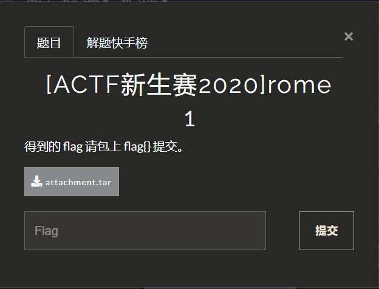
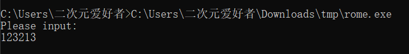
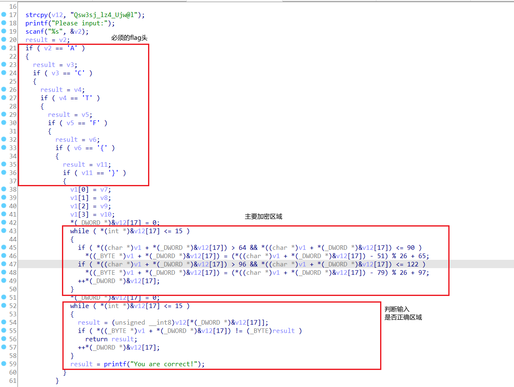
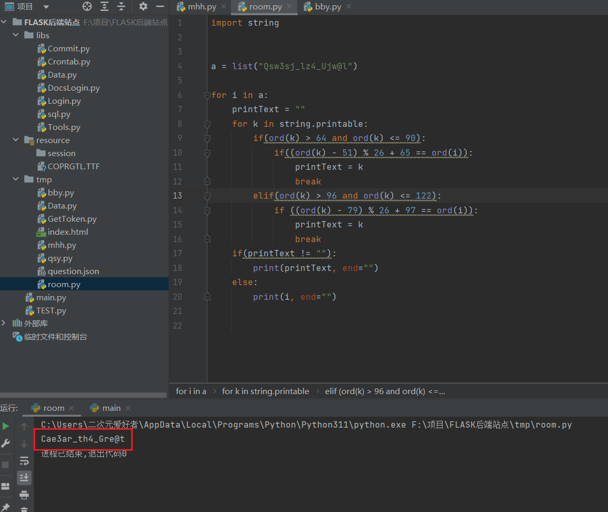
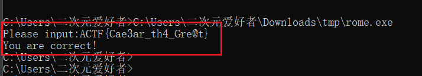
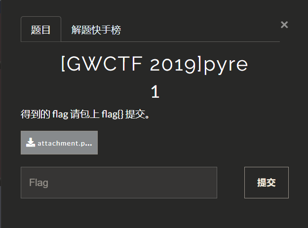
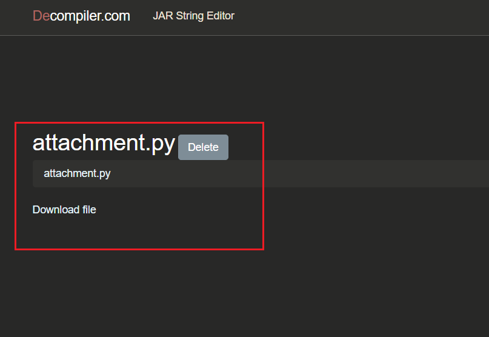
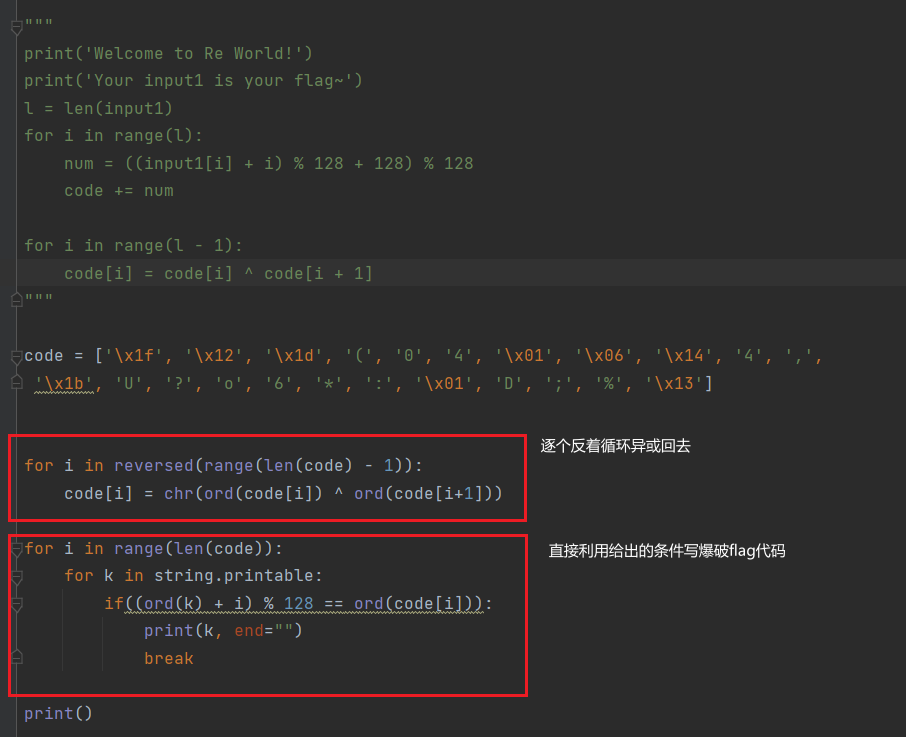
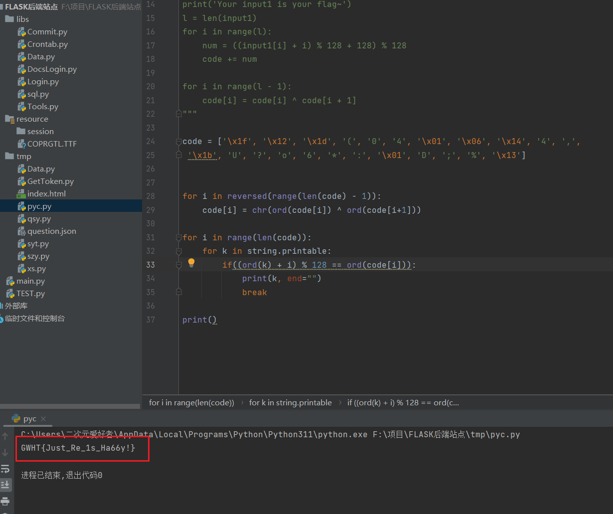

# re

## 1.[ACTF新生赛2020]rome 1



附件下载执行尝试输入没有错误信息



直接快进到定位加密处



直接看到加密过程有个`%`，`%`因为存在信息丢失所以基本是不可逆的, 但是这里给了明文范围`a-z|A-Z`而且加密过程都确定完全可以通过爆破得到`flag`，直接逐个字母尝试就可以得到`flag`其他不在范围内的字符串必然是没有进行加密的直接打印就可以了，解密脚本 ↓

```python
import string


a = list("Qsw3sj_lz4_Ujw@l")

for i in a:
    printText = ""
    for k in string.printable:
        if(ord(k) > 64 and ord(k) <= 90):
            if((ord(k) - 51) % 26 + 65 == ord(i)):
                printText = k
                break
        elif(ord(k) > 96 and ord(k) <= 122):
            if ((ord(k) - 79) % 26 + 97 == ord(i)):
                printText = k
                break
    if(printText != ""):
        print(printText, end="")
    else:
        print(i, end="")
```

执行得到明文尝试丢回原程序检验



检验无误



`FLAG{Cae3ar_th4_Gre@t}`


## [GWCTF 2019]pyre1



题目附件下载是一个pyc文件, 原本想用uncompyle6去转换成py代码的，但是我的python环境是3.11，而我通过pip下载回来的uncompyle6最多支持3.9（不支持你给我下载回来干什么pip）。只能去网上找在线网站转换了，找到一个很好用的网站https://www.decompiler.com/直接一键转换了还可以直接下载代码



把py下载回来分析，就是一个异或和一个取余，（这里我要吐槽一下这个取余操作，`(input1[i] + i) % 128 + 128) % 128` 这里的 `(...+128)%128`就是无用代码前面都已经`%128`了必然是`0-127`），由于涉及到取余所以会有信息丢失写反转代码基本是不现实的，直接爆破



开`run`得到`flag`



`FLAG:{GWHT{Just_Re_1s_Ha66y!}}`