# Re

## Rsa1

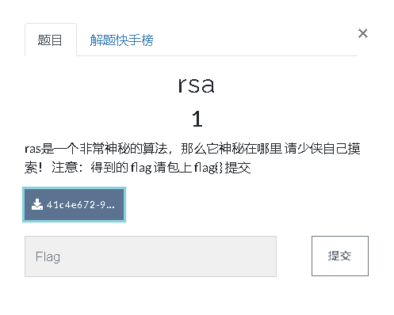

附件下载得到flag.enc和pub.key，摆明了是公钥分解

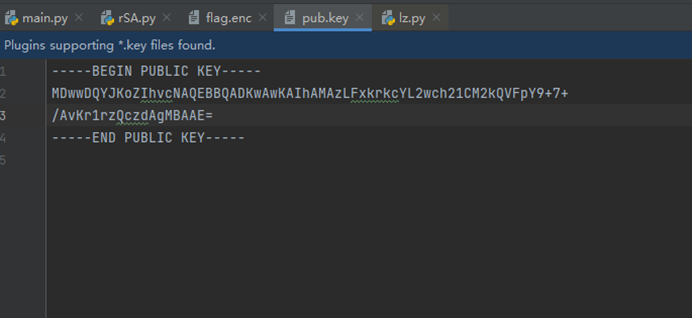

Openssl分解公钥得到N和e，命令`openssl rsa –text –modulus –pubin –in –warmup –in pub.key`

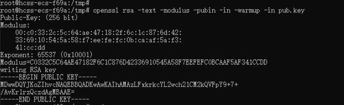

输出了加密指数e和模数n复制出来

N: C0332C5C64AE47182F6C1C876D42336910545A58F7EEFEFC0BCAAF5AF341CCDD

E: 65537

尝试通过yafu因式分解模数得到p、q，好家伙一下就明亮了

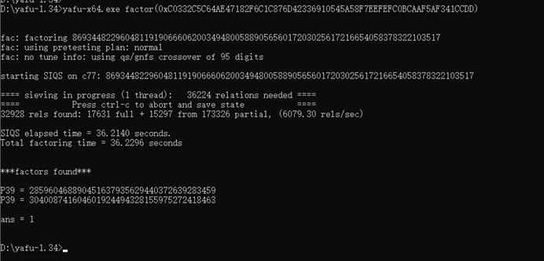

p,q,e可以还原私钥d，然后可以通过私钥解密出明文了

```python
import rsa
from rsa import PublicKey, PrivateKey
from gmpy2 import invert

flagEnc = open("tmp/flag.enc", "rb").read()
pubKey = open("tmp/pub.key", "rb").read()
 
n = 0xC0332C5C64AE47182F6C1C876D42336910545A58F7EEFEFC0BCAAF5AF341CCDD
e = 65537
p = 285960468890451637935629440372639283459
q = 304008741604601924494328155975272418463
d = invert(e, (p-1)*(q-1))
 
key = PrivateKey(n, e, d, p, q)
print(rsa.decrypt(flagEnc, key))
```

执行输出

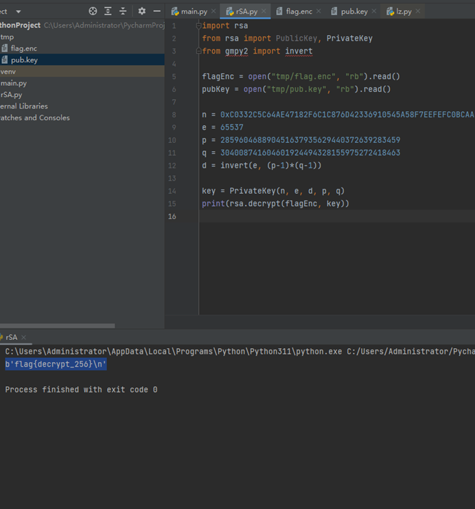

`FLAG: b'flag{decrypt_256}'`

## [WUSTCTF2020]level1

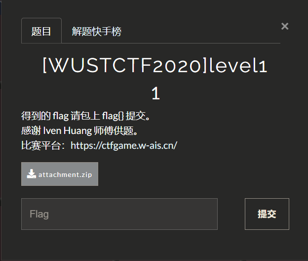

附件下载两个文件一个`level1`一个`output.txt`，打开`output.txt`是一些数字

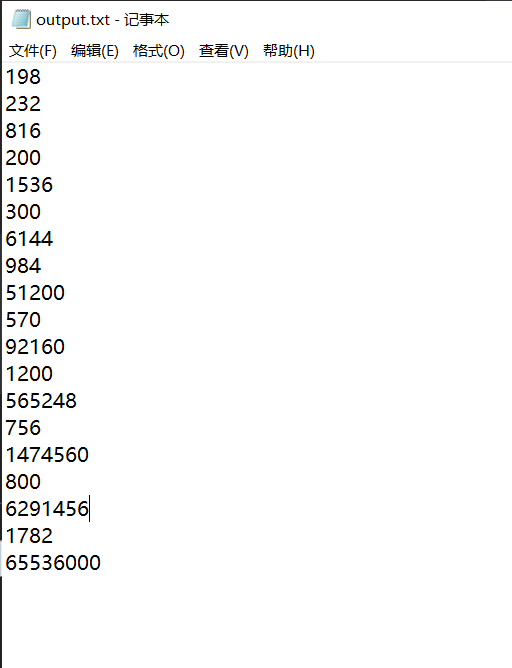

`ida`打开`level1`

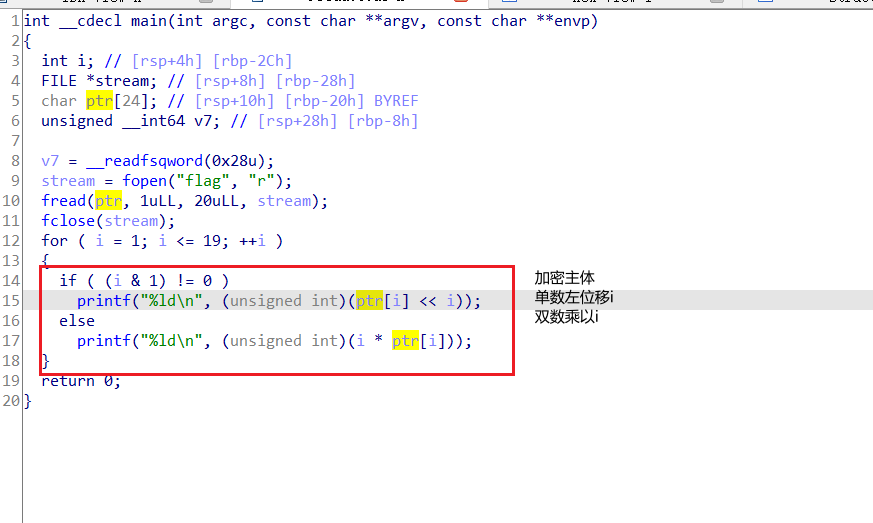

写个脚本反转加密部分

```python
a = """198
232
816
200
1536
300
6144
984
51200
570
92160
1200
565248
756
1474560
800
6291456
1782
65536000"""

flagEnc = a.split("\n")

for i in range(1,20):
    if (i & 1 != 0):
        print(chr(int(flagEnc[i-1]) >> i), end="")
    else:
        print(chr(int(int(flagEnc[i-1]) / i)), end="")
```

运行得到`flag`

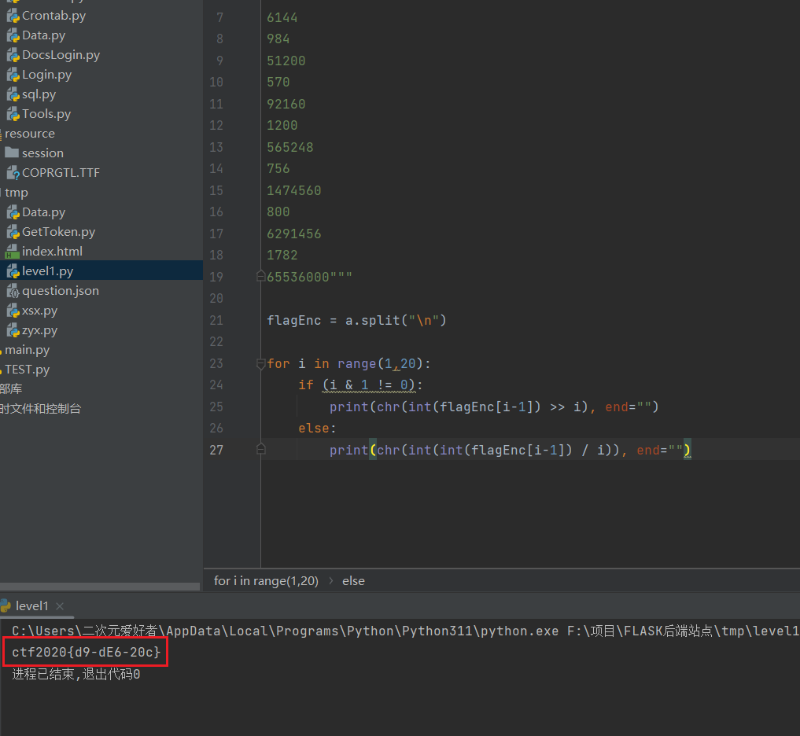

`FLAG:ctf2020{d9-dE6-20c}`

## [GUET-CTF2019]re1

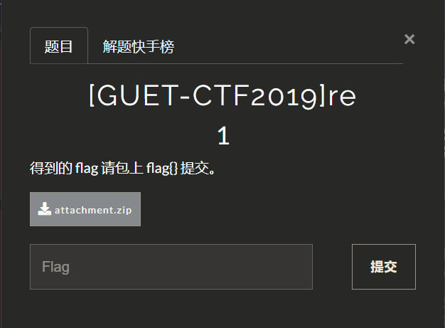


附件下载只有一个`re`，丢进`ida`查看代码乱得一批，直接看执行分支也是乱的一批，一会这个分支又跳回去，代码更是看不了一点

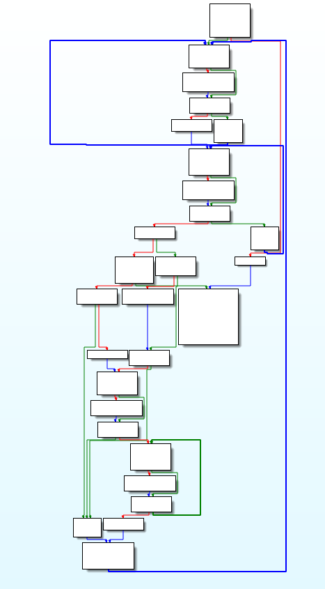

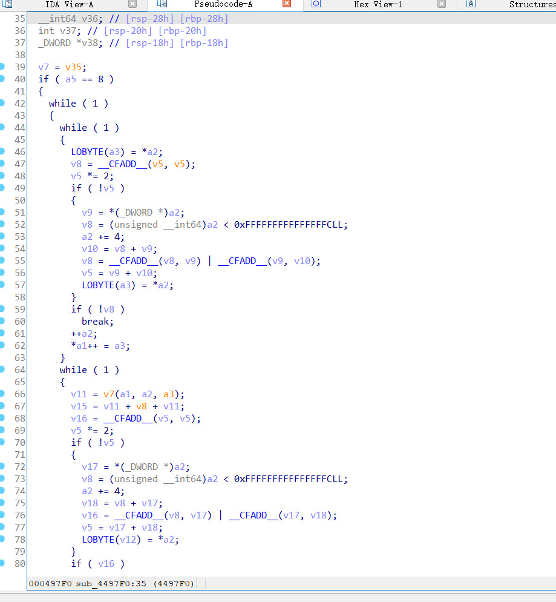

丢进exeinfo看看信息有upx壳

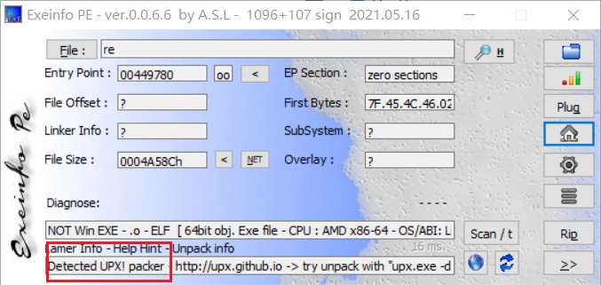

`upx -d re`脱壳后看到正常的代码

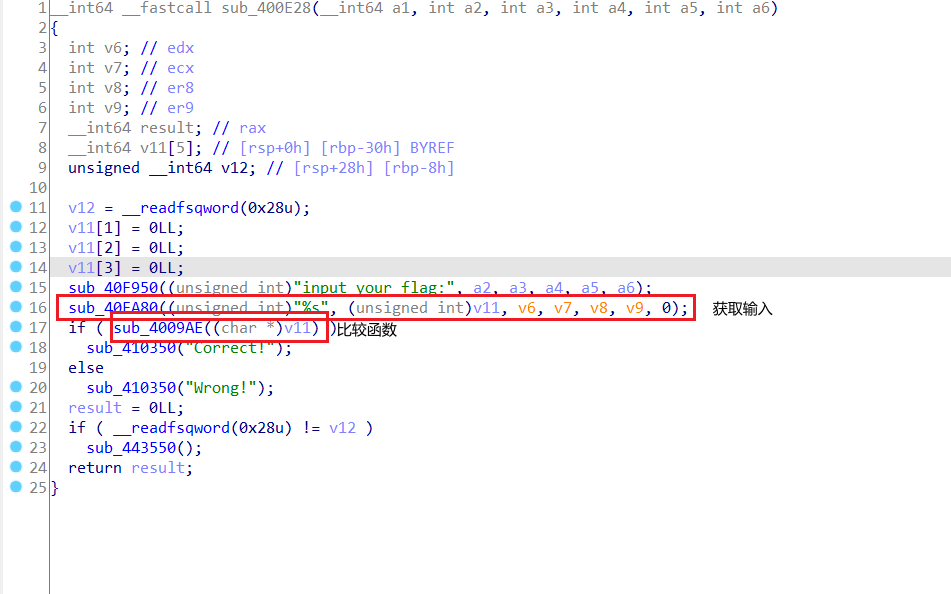

点进入`sub_4009AE`看到对输入的判断逻辑，真的是一个一个判断

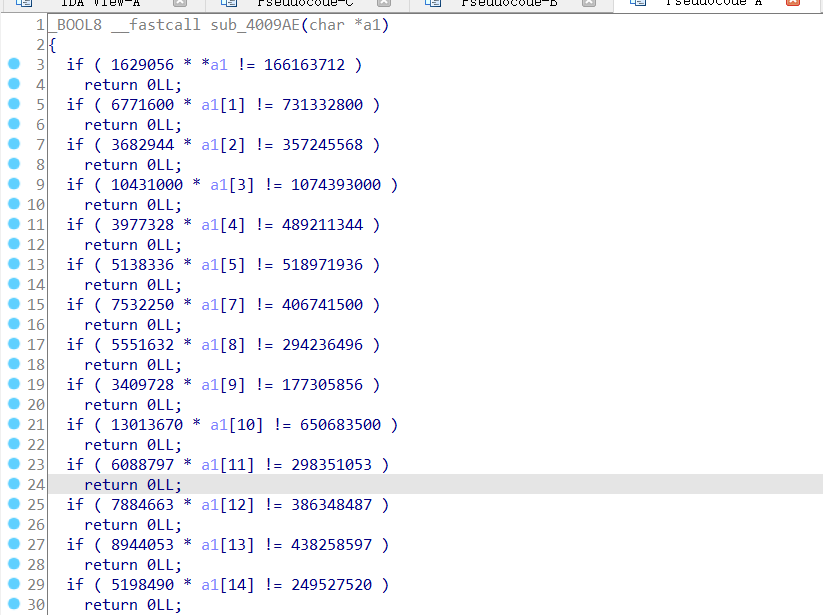

把这段代码扣下来，然后通过替换功能转换成`python`代码，一个一个`flag`输出，代码↓

```python
print(chr(int(166163712/1629056)),end="")

print(chr(int(731332800/6771600)),end="")

print(chr(int(357245568/3682944)),end="")

print(chr(int(1074393000/10431000)),end="")

print(chr(int(489211344/3977328)),end="")

print(chr(int(518971936/5138336)),end="")

print(chr(int(406741500/7532250)),end="")

print(chr(int(294236496/5551632)),end="")

print(chr(int(177305856/3409728)),end="")

print(chr(int(650683500/13013670)),end="")

print(chr(int(298351053/6088797)),end="")

print(chr(int(386348487/7884663)),end="")

print(chr(int(438258597/8944053)),end="")

print(chr(int(249527520/5198490)),end="")

print(chr(int(445362764/4544518)),end="")

print(chr(int(174988800/3645600)),end="")

print(chr(int(981182160/10115280)),end="")

print(chr(int(493042704/9667504)),end="")

print(chr(int(257493600/5364450)),end="")

print(chr(int(767478780/13464540)),end="")

print(chr(int(312840624/5488432)),end="")

print(chr(int(1404511500/14479500)),end="")

print(chr(int(316139670/6451830)),end="")

print(chr(int(619005024/6252576)),end="")

print(chr(int(372641472/7763364)),end="")

print(chr(int(373693320/7327320)),end="")

print(chr(int(498266640/8741520)),end="")

print(chr(int(452465676/8871876)),end="")

print(chr(int(208422720/4086720)),end="")

print(chr(int(515592000/9374400)),end="")

print(chr(int(719890500/5759124)),end="")
```

执行输出

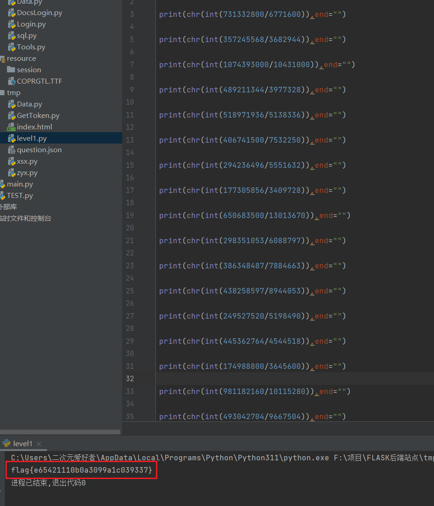

`FLAG:flag{e65421110b0a3099a1c039337}`