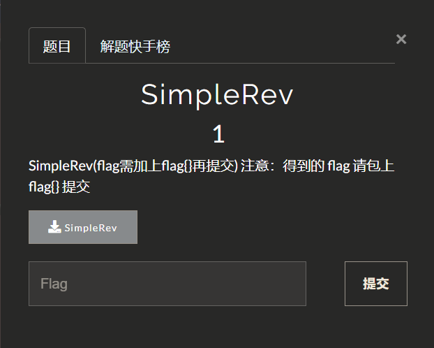
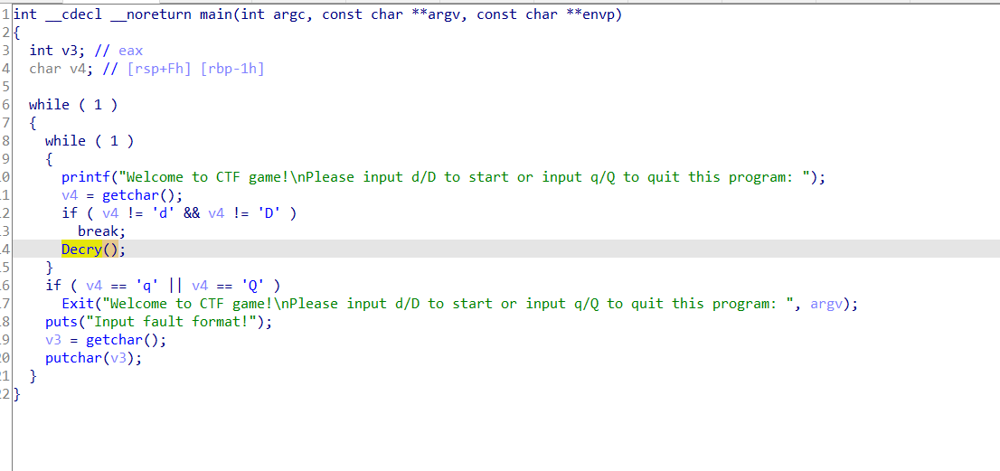
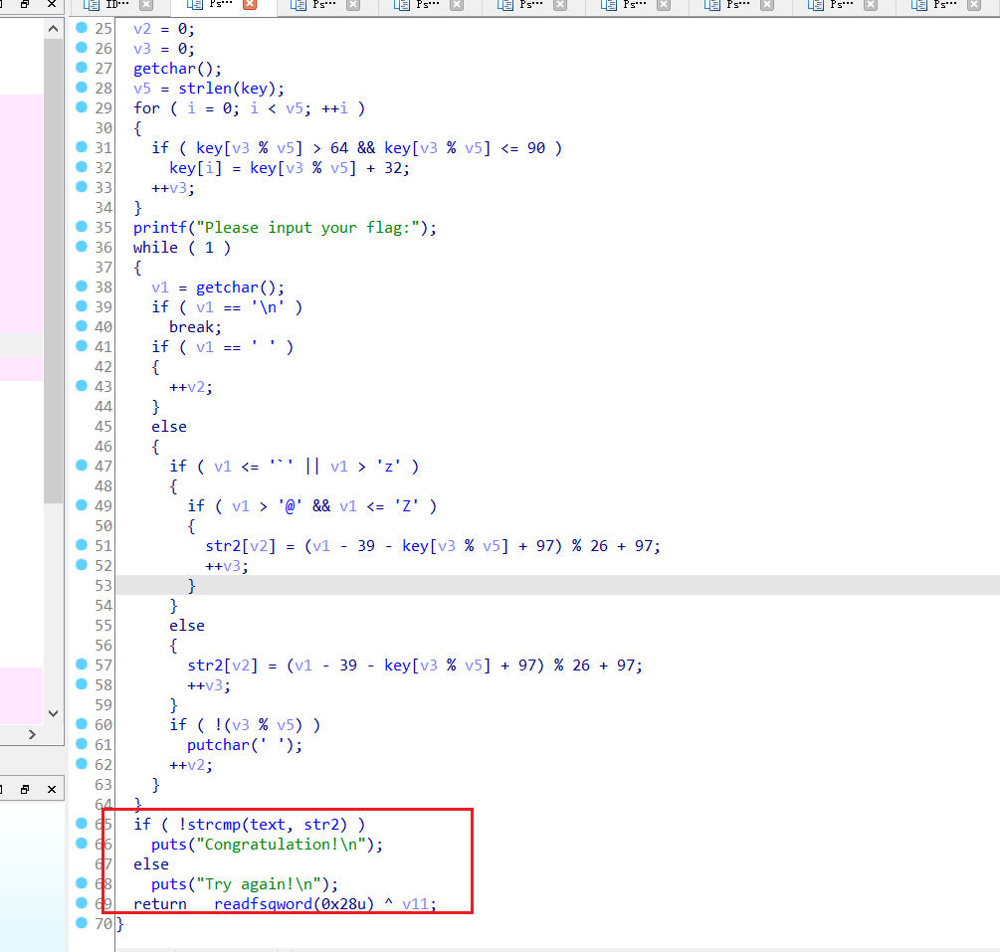
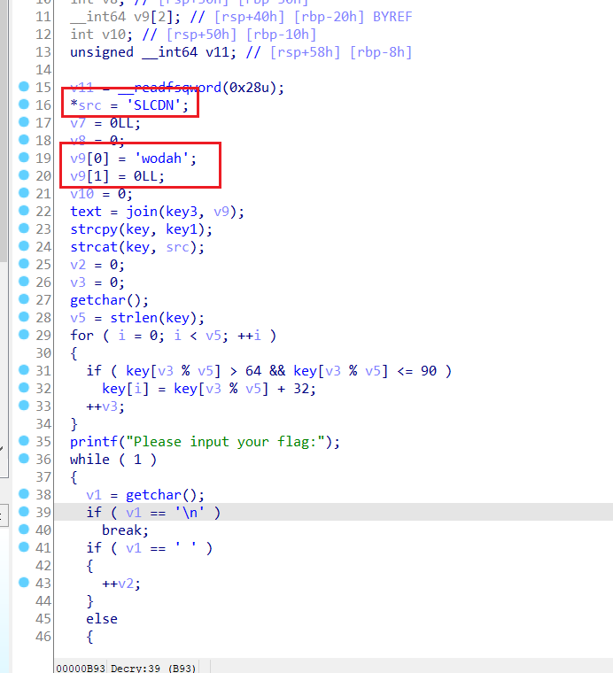
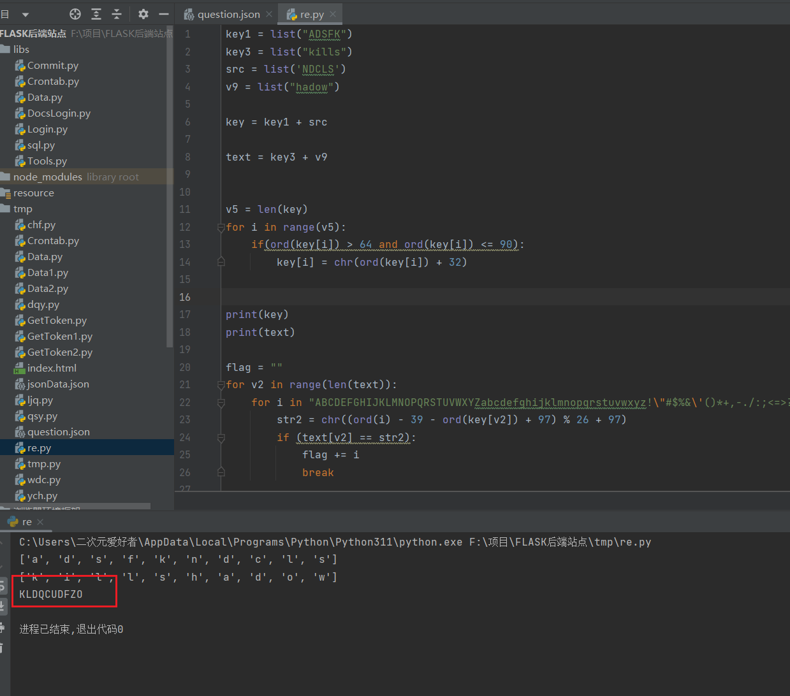

## SimpleRev1



题目下载回来一个elf附件，main函数没什么需要审计的就是一些提示信息跳转到关键函数Decry





对比text和str2如果相等就输出Congratulation!，反则Try again!。先审计下上面的一些赋值`key、src、v9、text、key1、key3`分别是什么，elf文件对于内存中的数据是小端序存储的，粗略分析这里的key、text、key1、key3都在存储在.data区域的, ida读取出来全是大端序的直接复制出来即可, 但是src和v9是在程序中动态赋值的，此时赋值的数据是不会被ida转换成大端序的，所以这里赋值就是以小端序赋值的要反过来，也就是src='NDCLS'、v9=hadow。




往下审计就是把用key去加密我们输入的v1然后对比text中的每一位是否相等, 由于涉及了%操作直接选择爆破是最优选项, 爆破的字符串顺寻也是有需求的，因为伪代码中的加密优先级是 大写字母>小写字母>其他字符，所以爆破时候遍历的字符串表就要按照这个需求来设置 `ABCDEFGHIJKLMNOPQRSTUVWXYZabcdefghijklmnopqrstuvwxyz!\"#$%&\'()*+,-./:;<=>?@[\\]^_`{|}~ \t\n\r\x0b\x0c`

```python
key1 = list("ADSFK")
key3 = list("kills")
src = list('NDCLS')
v9 = list("hadow")

key = key1 + src

text = key3 + v9


v5 = len(key)
for i in range(v5):
    if(ord(key[i]) > 64 and ord(key[i]) <= 90):
        key[i] = chr(ord(key[i]) + 32)


print(key)
print(text)

flag = ""
for v2 in range(len(text)):
    for i in "ABCDEFGHIJKLMNOPQRSTUVWXYZabcdefghijklmnopqrstuvwxyz!\"#$%&\'()*+,-./:;<=>?@[\\]^_`{|}~ \t\n\r\x0b\x0c":
        str2 = chr((ord(i) - 39 - ord(key[v2]) + 97) % 26 + 97)
        if (text[v2] == str2):
            flag += i
            break


print(flag)

```

运行输出flag




`FLAG:KLDQCUDFZO`