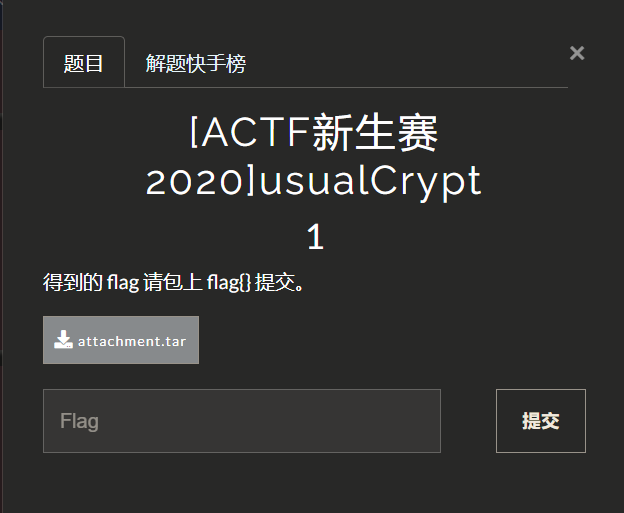
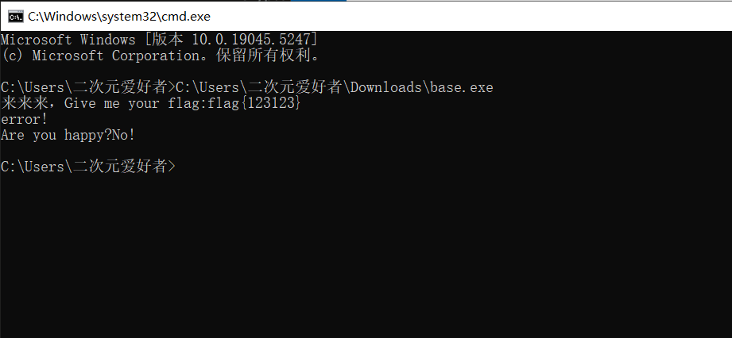
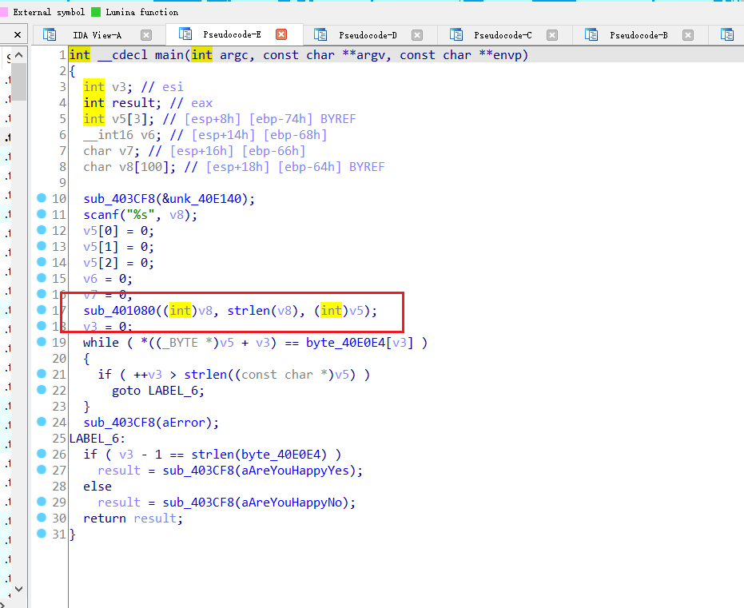
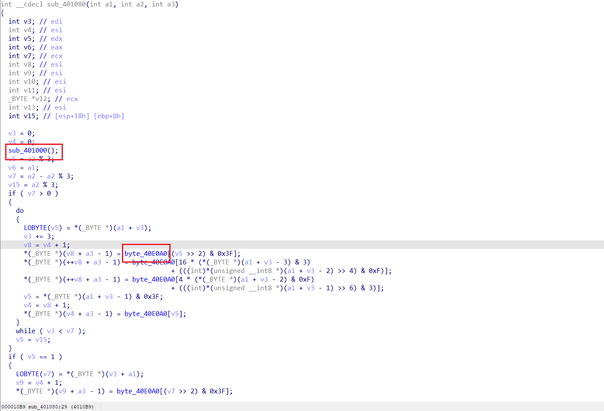
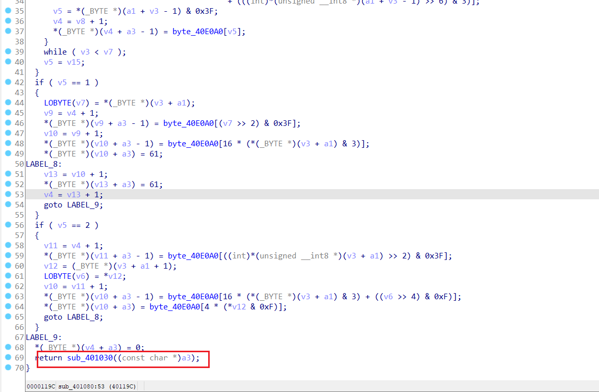
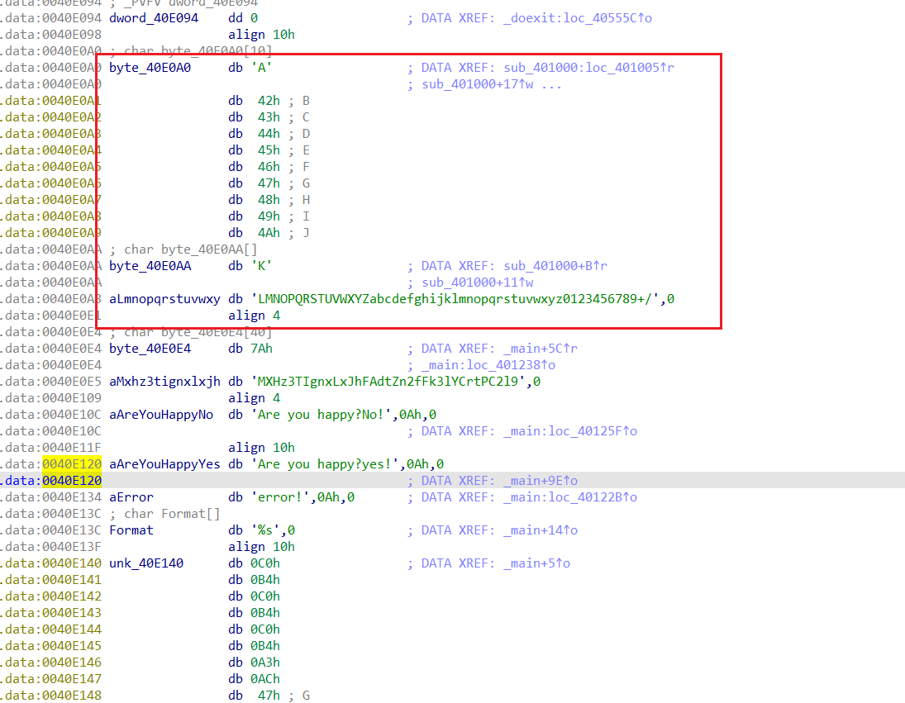
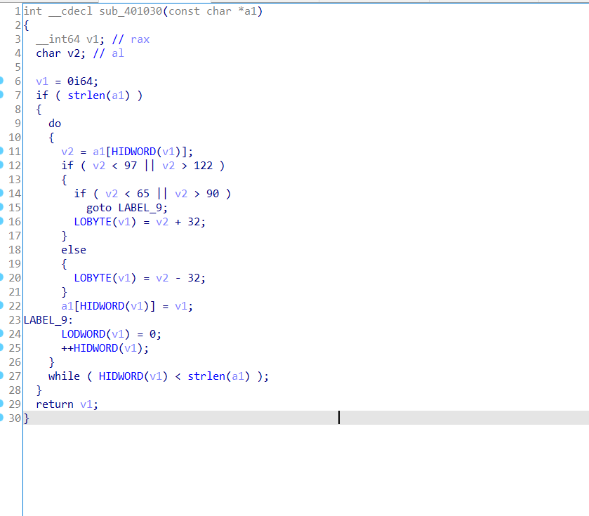
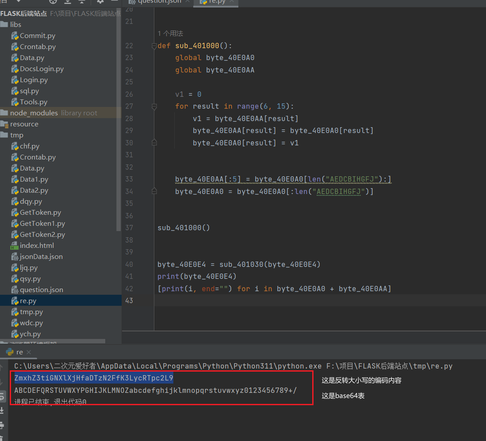
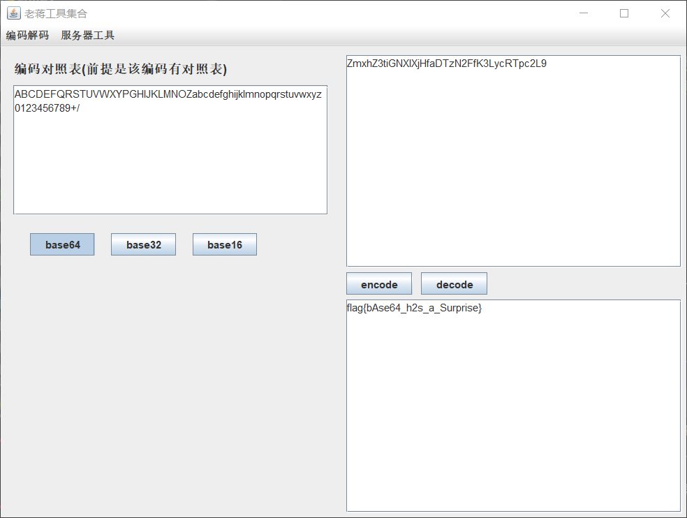

## [ACTF新生赛2020]usualCrypt1



下载一个附件，有flag输出错误提示



ida32分析分析得到sub_401080应该是加密函数，v8是我们输入的值



跟进发现逻辑有点看不懂，但是直接定位关键点猜测是什么编码通过表进行置换的，后面的函数跟进是大小写反转。





这个byte_40E0A0跟进一看这不是base64表吗



跟进sub_401000函数发现对表进行了一些操作，常规的base64换表+大小写反转直接写代码反转编码内容和base64表




编写python代码进行还原

```python
byte_40E0E4 = list("zMXHz3TIgnxLxJhFAdtZn2fFk3lYCrtPC2l9")


byte_40E0A0 = list("ABCDEFGHIJKLMNO")
byte_40E0AA = list("KLMNOPQRSTUVWXYZabcdefghijklmnopqrstuvwxyz0123456789+/")


def sub_401030(a1):
    result = ""
    for i in a1:
        if(i in "abcdefghijklmnopqrstuvwxyz"):
            result += i.upper()

        elif(i in "ABCDEFGHIJKLMNOPQRSTUVWXYZ"):
            result += i.lower()
        else:
            result += i

    return result


def sub_401000():
    global byte_40E0A0
    global byte_40E0AA

    v1 = 0
    for result in range(6, 15):
        v1 = byte_40E0AA[result]
        byte_40E0AA[result] = byte_40E0A0[result]
        byte_40E0A0[result] = v1


    byte_40E0AA[:5] = byte_40E0A0[len("AEDCBIHGFJ"):]
    byte_40E0A0 = byte_40E0A0[:len("AEDCBIHGFJ")]


sub_401000()


byte_40E0E4 = sub_401030(byte_40E0E4)
print(byte_40E0E4)
[print(i, end="") for i in byte_40E0A0 + byte_40E0AA]
```

运行结果



然后把base64表和加密内容放进解码器得到flag



`FLAG:flag{bAse64_h2s_a_Surprise}`