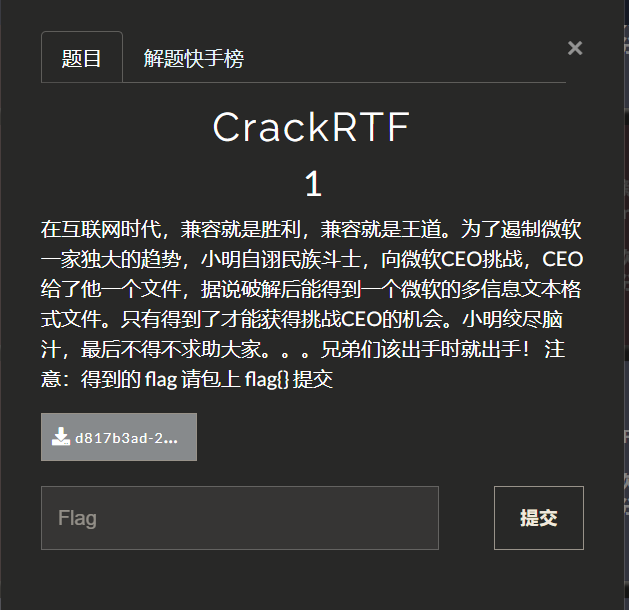
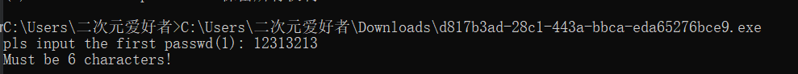
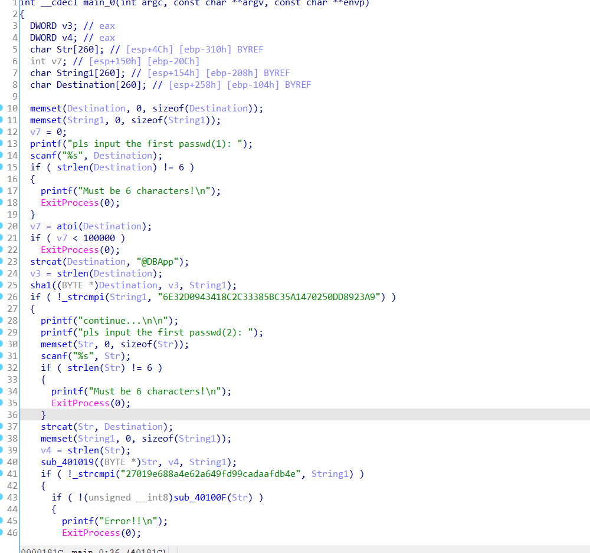
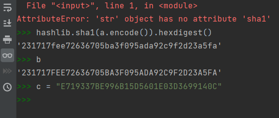
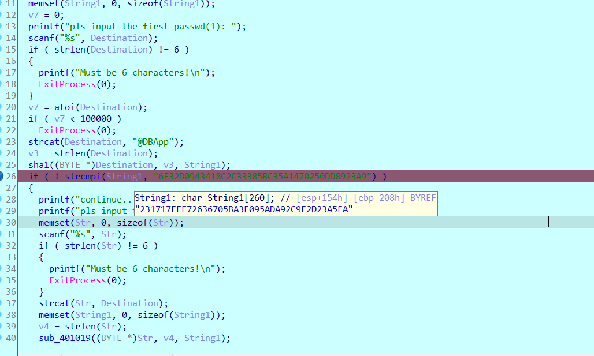
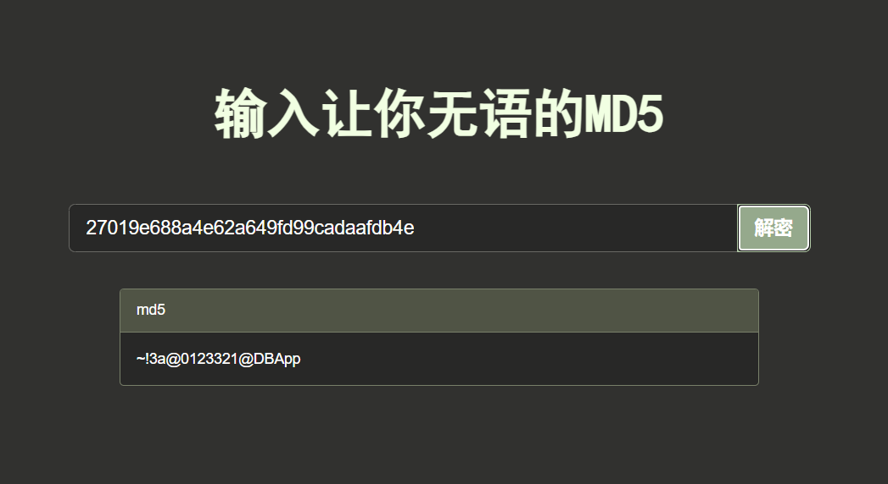
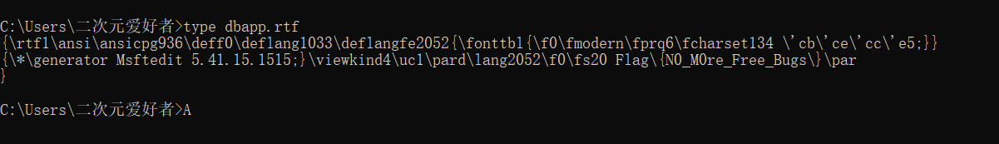

# CrackRTF1




题目下载直接是一个exe，执行就是输入pass1，有错误输出




ida看源码，是两个输入的加密判断



第一个判断的密文长度是40，第二个是密文长度是32，和sha1和md5的长度正好对一块了，通过动调控制输入验证得出正好和sha1的密文一致





第一个可以通过爆破得到pass1为`123321`

```python
import hashlib

pass1 = ""
for i in range(100000, 999999):

    sha1 = hashlib.sha1(f"{i}@DBApp".encode()).hexdigest()
    if(sha1.upper() == "6E32D0943418C2C33385BC35A1470250DD8923A9"):
        print(i)
        pass1 = f"{i}@DBApp"
        break


print(pass1)


"""
123321
"""
```

第二个就没有范围限定了，试过遍历0~999999进行碰撞不可行，尝试放到网站搜索得到最终pass（后面看了wp才知道这个是偷鸡做法）



将两端pass输入程序生成一个文件打开就是flag



`FLAG:Flag{N0_M0re_Free_Bugs}`