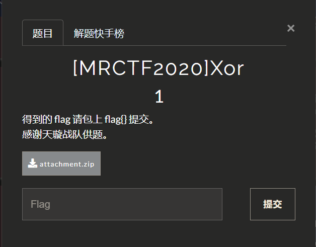
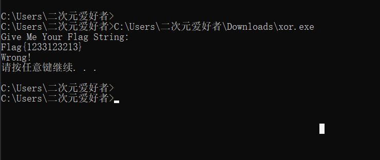
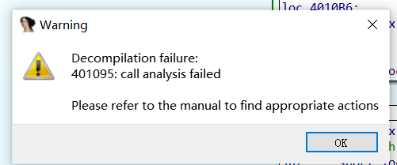
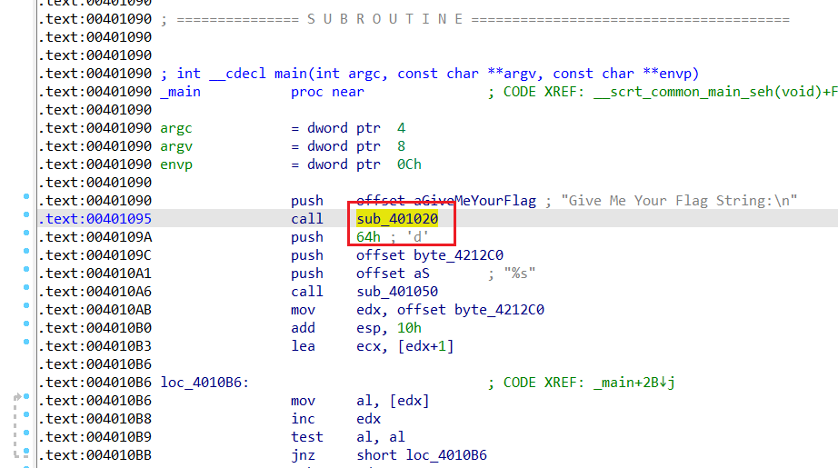
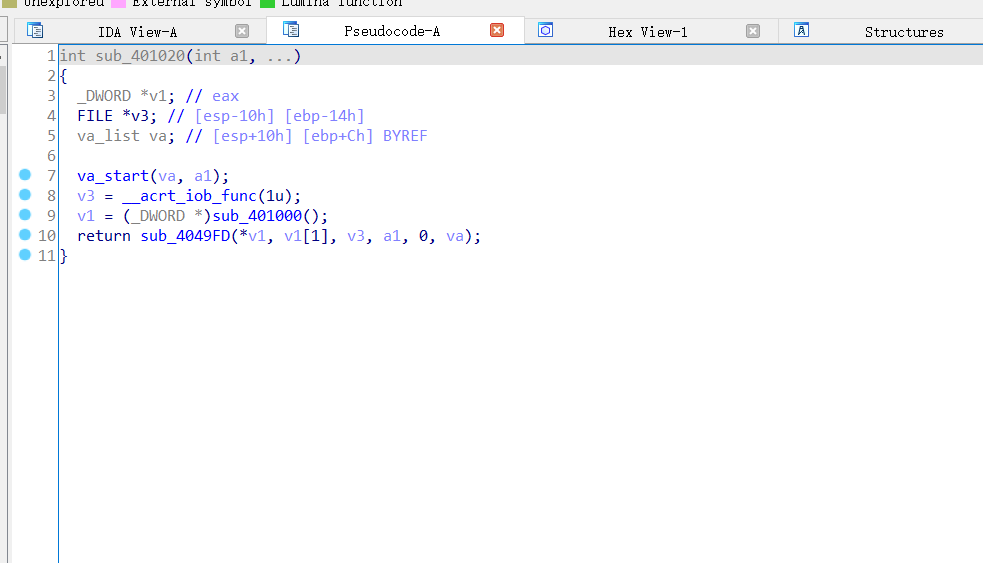
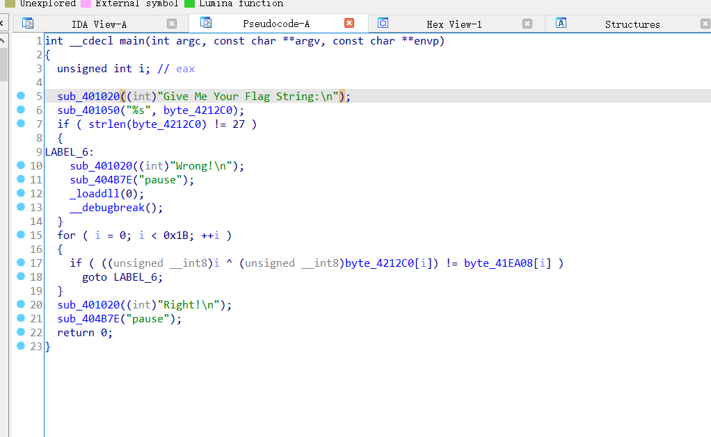
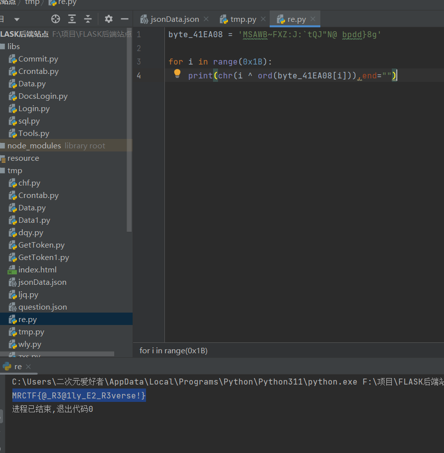

## [MRCTF2020]Xor1





附件下载一个exe打开提示要flag有错误输入提示



丢进ida转换伪代码出现报错提示401095地址分析call调用的函数错误



直接跳到401095这个位置，看到一个函数直接双击跟进进去看看能不能f5





双击进去f5之后出来f5就可以转换伪代码了（有点神奇还得分开转换）



整体代码看起来就是一个异或, 通过循环0~0x1B然后与输入值异或并与byte_41EA08做判断, 如果判断通过就Right!，写一个反推代码

```python
byte_41EA08 = 'MSAWB~FXZ:J:`tQJ"N@ bpdd}8g'

for i in range(0x1B):
    print(chr(i ^ ord(byte_41EA08[i])),end="")
```

润之后得到flag



`FLAG:MRCTF{@_R3@1ly_E2_R3verse!}`

