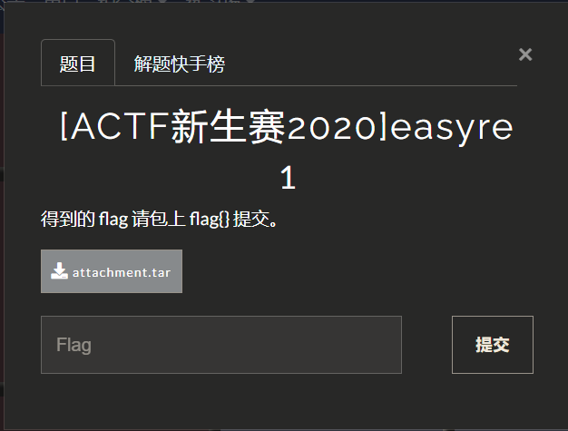
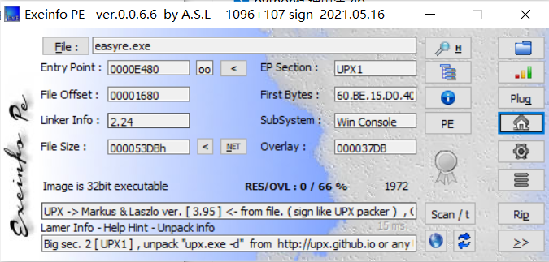
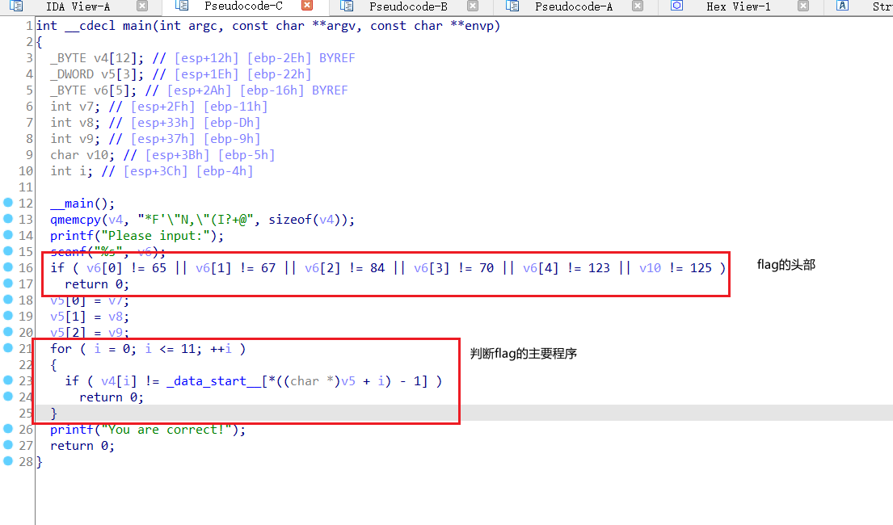
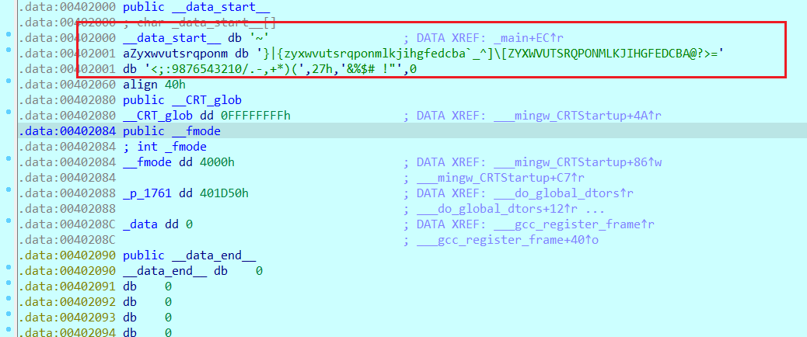
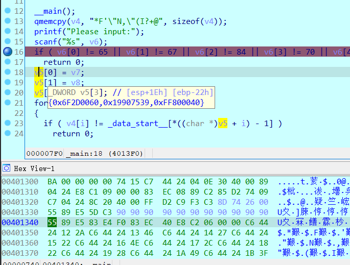
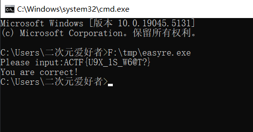

## [ACTF新生赛2020]easyre1



exeinfo查看有upx壳



upx脱壳后定位main函数地址



查看判断条件中已知值`v4、_data_start__、i`，动态赋值`v5`代表找到v5应该就离flag不远了，数组在下标取数读超过的情况下会直接继续读如果程序可执行的情况下，所以__data_start实际值需要往下取



接下来就是要确定这个v5是不是真的是输入的flag值，直接动调断点输入值为ACTF{123456}查看看看v5在内存中值进行了变化，虽然没有显式赋值但是一定有什么让他赋值了



可以看到这里的v5值是`0x6F2D006019907539FF800040`因为强制转换成char类型的指针, 所以会分成8个字节为一块进行读取, 正好12位，然后根据判断`v4[i] != _data_start__[*((char *)v5 + i) - 1]`反推`v5`，需要注意的点式这里的*((char *)v5 + i)是对v5进行遍历操作的，所以反推的时候要把这个看成一个整体，所以得出v4[i]在_data_start__中的索引之后直接+1就可以得到一串字符串`U9X_1S_W6@T?`

```python
a = list("*F'\"N,\"(I?+@")


data_start = '~}|{zyxwvutsrqponmlkjihgfedcba`_^]\[ZYXWVUTSRQPONMLKJIHGFEDCBA@?>=<;:9876543210/.-,+*)(' + chr(0x27) + '&%$# !"'

data_start = list(data_start)
print(len(data_start))


for i in range(len(a)):
    print(chr(data_start.index(a[i]) + 1), end="")
```

将这个字符串输入程序检验通过检测



`FLAG:ACTF{U9X_1S_W6@T?}`

### 该题总结：

不知道为什么脑子抽筋了把 + i也加入算法的一部分了，导致的出来的字符串怪怪得, 最后返回来看了一下才发现这个是c中用于遍历数组的, 没怎么了解c语言这点，还有这个DWORD类型强制转换char类型也是让我眼前一新, 第一次了解到对不同类型的强转换的读取方式.


