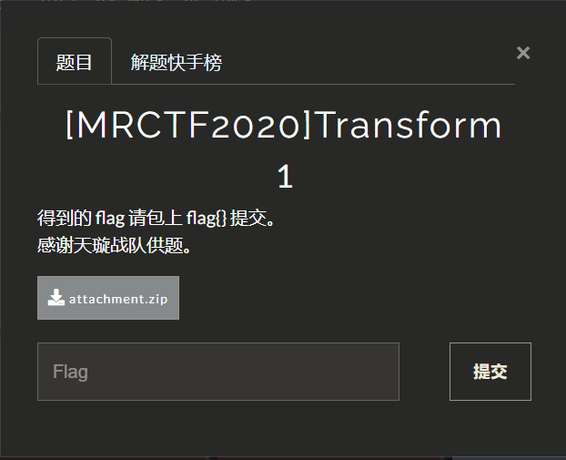
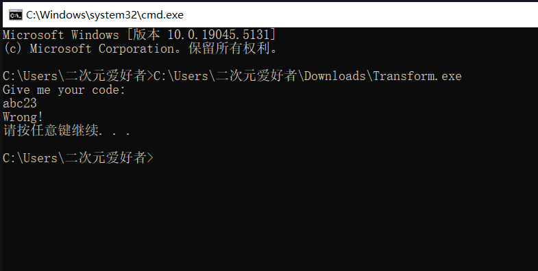
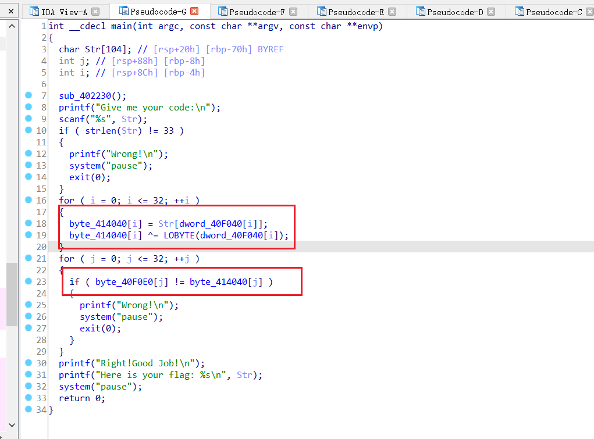
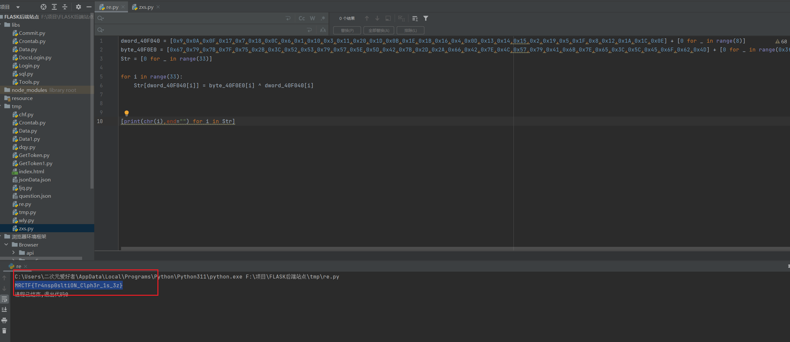

## [MRCTF2020]Transform1



下载回来一个附件，输入错误有错误提示



直接丢到ida分析，主体加密逻辑就是把Str的dword_40F040[i]下标赋值为byte_40F0E0[i] ^ dword_40F040[i]这里可能会有点绕但是稍微看下就能看懂了



把dword_40F040和byte_40F0E0分别扣下来然后写脚本复原即可

```python
dword_40F040 = [0x9,0x0A,0x0F,0x17,0x7,0x18,0x0C,0x6,0x1,0x10,0x3,0x11,0x20,0x1D,0x0B,0x1E,0x1B,0x16,0x4,0x0D,0x13,0x14,0x15,0x2,0x19,0x5,0x1F,0x8,0x12,0x1A,0x1C,0x0E] + [0 for _ in range(8)]
byte_40F0E0 = [0x67,0x79,0x7B,0x7F,0x75,0x2B,0x3C,0x52,0x53,0x79,0x57,0x5E,0x5D,0x42,0x7B,0x2D,0x2A,0x66,0x42,0x7E,0x4C,0x57,0x79,0x41,0x6B,0x7E,0x65,0x3C,0x5C,0x45,0x6F,0x62,0x4D] + [0 for _ in range(0x3f)]
Str = [0 for _ in range(33)]

for i in range(33):
    Str[dword_40F040[i]] = byte_40F0E0[i] ^ dword_40F040[i]


[print(chr(i),end="") for i in Str]
```

直接运行输出flag



`FLAG:MRCTF{Tr4nsp0sltiON_Clph3r_1s_3z}`